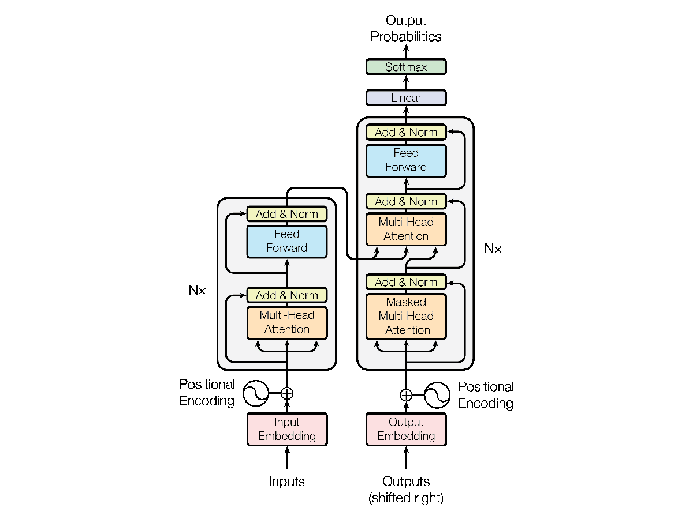
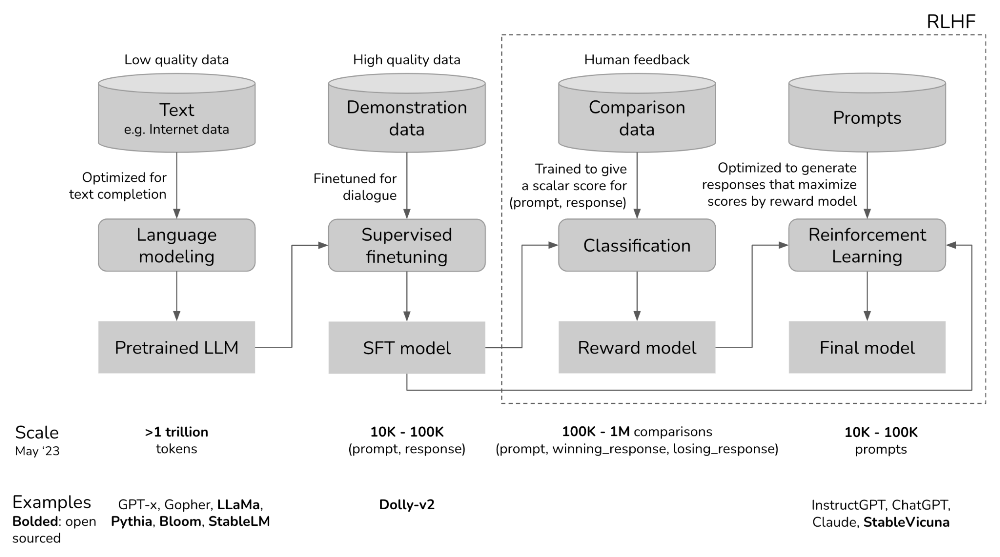
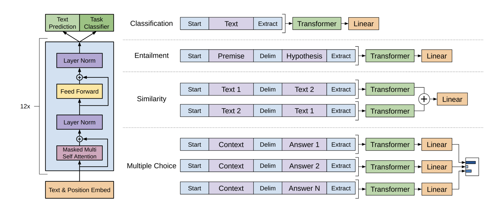
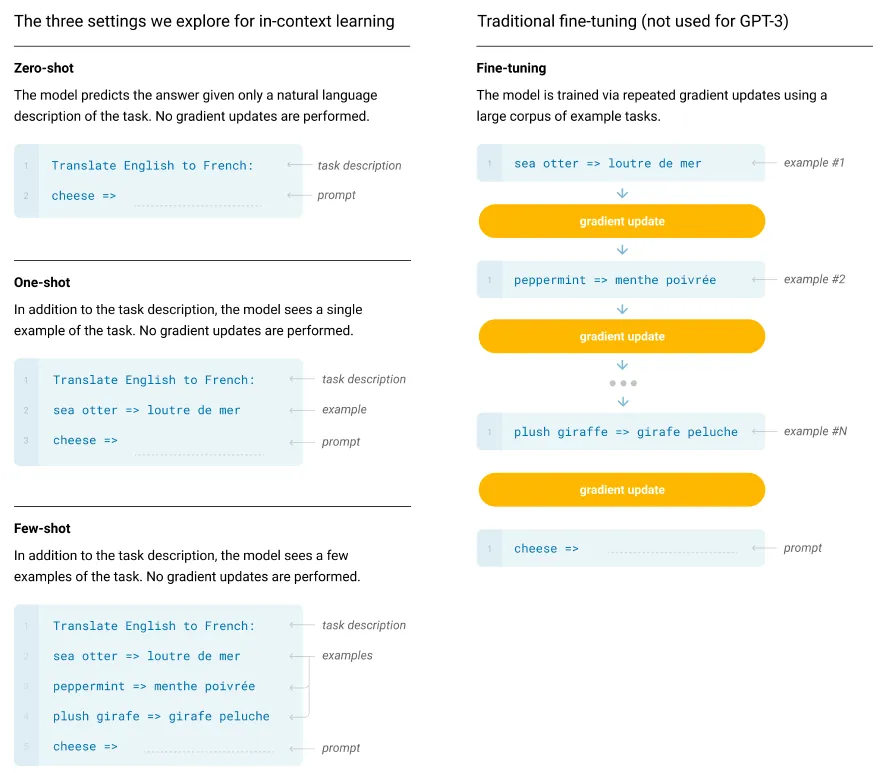
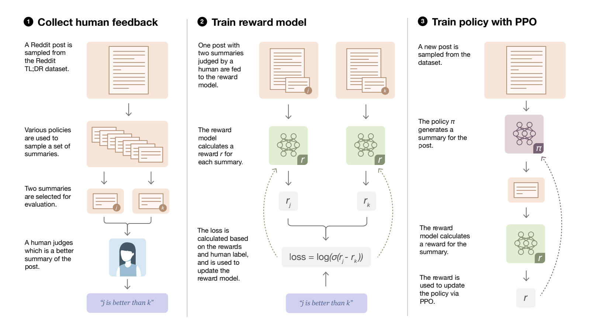

# Topic 14 - Backgrounds and Considerations for LLMOps

## What this repository do?

This is a special topic where I focus on the theoretical aspect rather than implementation. The topic is LLMOps, or in other word, Large Language Model Operations. The term may not be widely accepted since it is closely related to MLOps (Machine Learning Operations), with the only difference is that we are having a really complex model (except for proprietary models where we only have an access to the model via APIs, not the source code itself).

I have found several useful material so far, and will analyze it a bit, one by one, to see how the world discusses about Large Language Model, in the Report section. You can find them in the References section.

## References

### Theoretical Background on Transformers and GPTs

Understanding Flow: Attention Mechanism --> Transformer --> GPT (decoder of Transformer) --> GPT-1 --> GPT-2 --> GPT-3 --> Reinforcement Learning with Human Feedback --> InstructGPT.

In fact there is a report of GPT-4, but it is just a report of how the new one improves.

1. [Transformer] "Attention is all you need" (Paper, 2017) [[link]](https://arxiv.org/pdf/1706.03762.pdf).
2. [GPT-1] "Improving Language Understanding by Generative Pre-Training" (Paper, 2018) [[link]](https://cdn.openai.com/research-covers/language-unsupervised/language_understanding_paper.pdf).
3. [GPT-2] "Language Models are Unsupervised Multitask Learners" (Paper, 2018) [[link]](https://d4mucfpksywv.cloudfront.net/better-language-models/language_models_are_unsupervised_multitask_learners.pdf).
4. [GPT-3] "Language Models are Few-Shot Learners" [[link]](https://arxiv.org/pdf/2005.14165.pdf).
5. [RLHF a] "Deep reinforcement learning from human preferences" (Paper, 2017) [[link]](https://arxiv.org/pdf/1706.03741.pdf).
6. [RLHF b] "Learning to summarize from human feedback" (Paper, 2020) [[link]](https://proceedings.neurips.cc/paper/2020/file/1f89885d556929e98d3ef9b86448f951-Paper.pdf).
7. [InstructGPT] "Training language models to follow instructions with human feedback" (Paper, 2022) [[link]](https://arxiv.org/pdf/2203.02155.pdf).

### Byte-Pair Encoding Tokenization

This is the tokenization method that large language models apply. In "naive" tokenization, every word is a token. For example, *"This is a sentence"* will return us 4 tokens (This, is, a, sentence). However, BPE (Byte-Pair Encoding) is a simple and robust form of data compression in which the most common pair of contiguous bytes of data in a sequence are replaced with a byte that does not occur within the sequence. A lookup table of the replacements is required to rebuild the original data (by Wikipedia).

This is essential for researchers to know how much they would be cost for every query in the fine-tuning process.

8. "Byte Pair Encoding Tokenization" (Video) [[link]](https://www.youtube.com/watch?v=HEikzVL-lZU).

### LLMOps discussions

Proprietary or Open-source? On-premise or in the cloud? Should some transferring techniques be used? How to test, evaluate and deploy?

9. "Building LLM applications for production" (Blog) [[link]](https://huyenchip.com/2023/04/11/llm-engineering.html).
10. "LLMOps (LLM Bootcamp)" (Video) [[link]](https://www.youtube.com/watch?v=Fquj2u7ay40).
11. "Efficiently Scaling and Deploying LLMs" (Video) [[link]](https://www.youtube.com/watch?v=AVccFl8-5-8).

### Additional References

12. "State of GPT" (Video) [[link]](https://www.youtube.com/watch?v=bZQun8Y4L2A)
13. "LLM Bootcamp" (Series of Lectures) [[link]](https://fullstackdeeplearning.com/llm-bootcamp/)

## Motivation

This is a bit odd that a README file in my collection has the motivation part. But it is strong enough that I include it here.

So far, I took part in an interview for a team that tries to employ LLM for there testing framework. The project was 2-month old then and the only thing they figured out is that ChatGPT knew about there product (well I think it is indeed since there product was release in about 2018-2019). Their understanding on LLM (or even about Natural Language Processing) made me confuse about the expected outcome of this project, since to perfectly adapt LLM, both theoretical, technical and financial aspects should be taken into consideration.

*In theoretical aspect*, we should have learned how useful an answer generated by LLM can be, and what is the minimum length from a prompt that clearly defines the objective so that LLM can understand and give such an useful answer. We should know that LLM is a generative model, and in common sense, it just give out the token with the highest probability given the previous $n$ tokens. Indeed $n$, or context window, is not indefinite. Hallucination or toxicity are typical concerns from both the authors and community, so keep it in mind.

*In technical aspect*, which LLM should we choose, which data should we collect, and how to deploy it. Currently I do not have such a clear understanding about every LLM existing in the industry right now and the number of LLMs is increasing significantly.

*In financial aspect*, every token counts. For open-source model that we would like to "download" it, fine-tuning it, then deploy it, then how much cost should it be. If context window is limited, so is our budget.

Although I do not know that I will be part of a team that employs a LLM model or not, this should worth exploring for any other machine learning or deep learning architecture for any problem that artificial intelligence can be a great supporter.

## Report

This is not the final version. The report will be updated regularly since there may be some mistakes that I made or some representation I found confusing during writing.

### Chapter 1: Attention, everyone

*"You just want attention, you don't want my heart"* - This might be true for some aspects in Natural Language Processing since the attention-based architecture has become state-of-the-art wrecker in many NLP tasks. But what is actually attention? In translation tasks, is it like looking for a word then simply translated it in a rule-based manner? Gladly, the answer is no.

But before going anywhere further, let state an example that is widely used to explain the concept of attention mechanism: *Neural Machine Translation*.

**Neural Machine Translation**

Neural machine translation (NMT) is an approach to machine translation that uses an artificial neural network to predict the likelihood of a sequence of words, typically modeling entire sentences in a single integrated model.

For instance, we want to translate: *It's time for tea* (EN) to *c'est l'heure du thé* (FR) or *Đã đến giờ uống trà* (VI). The high-level target is to get
$$P(\text{c'est l'heure du thé} | \text{It's time for tea})$$
have the highest value comparing to any other French sentence. But sadly, the number of possible combinations to generate a sentence, in any language, can be non-trivial to count. Therefore, we want to get each token, one by one, have the highest probability.

$$P(\text{c'est} | \text{It's time for tea -})$$
  
$$P(\text{l'heure} | \text{It's time for tea - c'est})$$
  
$$P(\text{du} | \text{It's time for tea - c'est l'heure})$$
  
$$P(\text{thé} | \text{It's time for tea - c'est l'heure du})$$

This is actually the right objective when we use word tokenization, if we used byte-pair encoding tokenization, some word would have been splitted into small chunks. However, the aim is still there, predicting the next token.

**Query, Key and Value**

Something familiar here. Is this the database course? Or a Python course where we are learning about dictionary? No, of course.

In machine translation task, we will have:
- Query as the original sentences.
- Key as the translated sentences.
- Value as the translated sentences (same as key).

Imagine you have booked a room in a hotel, and you tell the receptionist that *"I have booked the room with reservation code SH38I5"* (query). The receptionist looks up in their booking system, and found that reservation code you gave matches a room with number 2033 (key), so she give you the key and enter the room (value).

That is easy when any query can be mapped to a key, but we want more, as in tranlation, we want to look at more than 1 word to form the correct translation, for looking for the correct tense, subject, etc.

Now, the booking system earned its magic, and customers can book more than 1 room per reservation. In fact, the number of rooms can unnecessarily be an integer. They can book 70% facilities of a room, and 20% of another room. Finally, when they arrive with the query, the receptionist gives them a crafted key with the access to both rooms.

Back to the machine translation task, with 2 languages, we will have 2 independent vector spaces with same number of dimensions. Each word/token becomes a vector in the corresponding vector space. We now want to find the best translation from a word in vector space A to a word in vector space B, but consider the context of the original sentence. In particular, when finding the translation for the word "đi" in the sentence "Tôi đi xem phim tối hôm qua" (VI), the correct translation should be "went", not "go" or "goes". What should be taken into consideration is the word "đi", "hôm" and "qua" (hôm qua = yesterday, so past tense is restricted). How these words are taken by the model? Just simply looking for "similarity". But it doesn't mean that "hôm" and "qua" is similar to "đi", it may just represent that these are the word that supports you for finding the best translation, with the ultimate word here, "đi".

Later on, you will find that in encoder part of the transformer, query, key and value are the same, since we are having only 1 sentence to process.

**Scaled Dot-Product Attention**

Go straight to the formula:

$$\text{softmax}\left(\frac{QK^T}{\sqrt{d_k}}\right)V$$

where $Q$ is query, $K$ is key, and $V$ is value matrix.

- $QK^T$ is the computation to find the "similarity" between token. The output matrix, let say $O$, will have $o_{ij} = q_i \dot k_j$, or the similarity between token $i$ and token $j$ of the 2 sentences (or at the same sentence if we are using one only).
- $\sqrt{d_k}$ is the scaling factor. In the paper [1], they assume that the components of $q$ and $k$ are independent random variables with mean 0 and variance 1. Then their dot product has mean 0 and variance $d_k$. If another assumption is added, *the variables are normally distributed*, then it is easily figured out they are scaling the values by subtracting mean (0) from the original values then divide it by the standard deviation $\sqrt{d_k}$.
- Use softmax to normalize each query sum to one, then we obtain the weights.
- Finally, the weights and value matrices are multiplied.

Depending on the key and value matrices computation, we will have 3 different types of attention.
- The example given for machine translation is **encoder-decoder attention**, where they query and key are from difference sentence.
- If the query and key are the same, we will have **self-attention**.
- If the query and key are the same, and queries don’t attend to future positions, we will have **masked self-attention**.

Transformer architecture employs only self-attention and masked self-attention. Since in the encoder part, we have only 1 sentence to process. The aim is to enrich each token reprsentation by considering neighboring tokens every time it is passed to a layer. The decoder part use masked self-attention because we don't know about things will be in the future (we have not generated predictions for those yet).

**Multi-Head Attention**

The aim of multi-head attention is to learn multiple relationships between the words from the query and key matrices. I may assume that there is a head computing the "financial" relationship between 2 tokens, other one is considering "political" relationship, other one is considering "scientific" relationship, etc.

At a high-level explanation, multi-head attention is just combining the results for many self-attention modules (or heads), in a proper manner.

**Transformer Architecture**

You may see this figure a lot of times, if you are working on NLP. But I still show it here though.



There are additional concepts that are included and help increase the performance of the transformer family (add & norm, or positional encoding). It won't be discussed in this report currently but will be added when I have more time.

### Chapter 2: GPT

**Overview**

GPT is built as a multi-layer Transformer decoder for the language model, which is a variant of the transformer.

The below figure from a [blog](https://huyenchip.com/2023/05/02/rlhf.html) demonstrates how ChatGPT is trained.



**Unsupervised pre-training**

First found: GPT-1.

The objective of this stage is rather simple, similar to what we have defined in the neural machine translation part in the first chapter. In particular, given a vast corpus, which is a set of documents. Each documents contain a list of tokens, from $u_1$ to $u_k$. The model aims to maximize the likelihood:

$$L_1 = \sum_i \log P(u_i | u_{i-k}, \dots, u_{i-1}; \Theta)$$

**Supervised fine-tuning**

First found: GPT-1.

This works on a labeled dataset $C$, where each instance consists of a sequence $x^1$ to $x^m$ along with a label $y$. The objective of this task is to maximize:

$$L_2 = \sum_{(x, y)} \log P(y|x^1, \dots, x^m)$$

It is demonstrated in the paper that in this stage, the loss can be a combination from both tasks:

$$L_3 = L_2 + \lambda \times L_1$$

where $\lambda$ is the weight of the first loss objective. This loss function improves generalization of the supervised model and accelerates convergence.

**Defining downstream tasks**

Found: GPT-1, GPT-2

In GPT-1, defining the task is done by a set of special tokens. For example, we will have start token and end token in general, premise indicator token and hypothesis indicator token for textual entailment, document, question, answer indicator tokens for question answering, etc.



However, in GPT-2 paper, they believe that including the task in the inputs can still enable the language models to give a sufficiently acceptable output. For example: *“Brevet Sans Garantie Du Gouvernement”, translated to
English* gives the output *Patented without government warranty.* without any specification of task-specific special tokens.

The above example is known as zero-shot learning, where the task can be inferred from the prompt, but note that the task should have some examples included in the training dataset.

**Zero-shot, one-shot, few-shot learning**

First found: GPT-3

The paper demonstrated the concept of in-context learning, which is learning from the prompt itself.



It showed that with a task description and few examples, language model is able to give the desirable answer.

**Reinforcement Learning with Human Feedback**

Reinforcement learning, in my simple view, equals an agent + environment. Agent does action following a policy (policy in this case is the model architecture and weights), environment returns reward. There is also a term, space, but I am ignoring it for simplicity.

In language modeling, the agent is the LM, and the action space is indefinite, which is combination of tokens forming a conversation. Since we are dealing with continuous action space, policy gradient methods is suitable for defining the best policy (model weights), for example, proximal policy optimization.

But what about the reward, how to form the environment. As the name says, human feedback will form the environment, as in the below figure demonstrating the process of fine-tuning with RLHF:



Overall, you can read this [blog](https://huyenchip.com/2023/05/02/rlhf.html), another nice blog by Huyen Chip for understanding how the training process of GPT is conducted intuitively and mathematically.

### Chapter 3: LLMOps

**Summary of collected references**

For those who does not read or watch any of the references in the LLMOps discussions part, here are a bit keywords that summarizes the discussions:
- *"Building LLM applications for production" by Huyen Chip* [9]: Prompt engineering are facing with a challenge of ambiguity, i.e., answers from LLM is not always the same, or inconsistent. The blog provides some techniques to improve the usefulness and consistency of those answers. The most obvious one is to modify the `temperature` argument to 0. Besides, similar to feature engineering & model development, prompt engineering should have act as a set of experiments, where we need to track tested prompts, version the prompts like models, evaluating the prompts, and optimizing the prompts to get the highest evaluation. Cost and latency are considerations to decide between buy (using paid APIs) vs. build (using open source models). Integration of your own data and then use LLM to query information as well as get insight for end-users is a potential path, in which LangChain provided (LangChain is not discussed in the blog). This is followed by the popularity of vector databases to store and retrieve documents. A discussion about an agent which was built on top of LLMs and includes 3 steps is provided. The tasks are: (1) convert natural language input from user to SQL query [LLM], (2) execute SQL query in the SQL database [SQL executor], (3) convert the SQL result into a natural language response to show user. Having this instructions should increase the expected output that a LLM can return.
- *"LLMOps" from LLM Bootcamp* [10]: The speaker provided a full process of developing and deploying LLM in production. However, he preferred to deliver the talk on buying rather than building. This is understandable since new practitioners may take the life at risk if they thoughtlessly decided to build, deploy, and maintain and LLM for their firms. The process consists of: choosing the base model, iteration and prompt management, testing, deployment, monitoring, continual improvement and fine-tuning. Considerations for choosing a base model comprise: expected quality for your downstream task, latency, cost, fine-tuneability, data security. When data security may not be a major problem, most use cases can be adapt using GPT-4 or proprietary LLMs, which are stated as better nowadays by the speaker. Same topics were delivered in prompt management to Chip's blog. Testing LLM requires (1) the prompts in developing (for prompt tuning) and production must not too different, and (2) an evaluation scheme should be proposed, where the ground truth can be a correct defined answer, a referenced answer, previous answer, or human feedback. After deployment, monitoring important signals is essential, such as: outcomes & user feedback, proxy metrics, incorrect in measurement, etc. At the end of the talk, the speaker gave a test-driven development taxonomy for LLMOps. It starts with prompt/chain development, logging and monitoring, then fine-tuning when needed. The process is iteratively, and the collaborators expand from developer, team, and finally the customer.
- *"Efficiently Scaling and Deploying LLMs"* [11]: In contrast to [10], the speaker considered more on building a LLM. The decision of building LLM is mostly by data ownership, controllability, and model ownership. Competitors want their stuff private and use it to train their model with better introspection, explainability, and portability. There are two mythical barriers for practitioners when deciding to build a model instead of using the APIs. First is LLM training is too expensive, and second is planning for the technological stack and deployment strategies are extreme. However, the speaker stated that deploying a GPT with 7 billions tokens takes only 30k USD, which is the common use case in business. In addition, the community is developing new tools for supporting deployment of LLMs. Finally, there is a LLM training stack that consists a list of tools can be used for developing LLMs, and I believe the list will be expanded through time, even if the video is a few-weeks or few-months old.

**Planning simulation for applying LLM**

I will apply something I have learned on product management, which I studied for data science interview, to brainstorming the options for developing a LLM-supported application.

*Problem Statement:* Simple! We need to have ChatGPT in our learning app.

But the more short the problem statement, the more questions we need to ask for clarifying the problem. Sadly, this is the statement that most customers ask, especially in Vietnam.

The five steps in brainstorming a solution, if we want to develop things systematically, includes:
1. Clarify
2. Constraints
3. Plan
4. Method
5. Conclude

**Step 1: Clarify**. In broader terminology, the customer want to use Large Language Model to improve the user experience in their learning application. I believe that the reason they claim ChatGPT because this is the most popular and may be the only one they know, so I will try to explain that we may decide to use ChatGPT or other LLM depending on the constraints.

Another thing we need to clarify is the domain they are teaching. It only includes school programs, technical programs, or anything else. There are many domain-related questions that can be asked in this stage, and even when you proceed to the next stage, some will still be pop up.

We need to define is the objective. Sometimes, even deciding to use LLM can be such a waste due to the fact that it does not contribute anything to the business goals. Revenue and user engagement for web/mobile apps are the most ultimate goals, of course, but we want to explore how LLM benifits the organization. For this case, let say the customer is currently having an interactive Q&A section for users, where hired employees (experienced teachers) will answer some of users' concerns in their homeworks or lectures. By using LLM, we can reduce the cost of hiring these teachers, and have them work on other tasks, such as improving the curriculum for the courses, building more interesting teaching content, etc. (doing other creative tasks are more lenient than firing them because of the existance of an AI model).

Next is to define more fine-grained goals. The ones we have discussed so far form **organization goal metrics**: revenue, user engagement, and employee efficiency. We need to have **driver metrics** and **guardrail metrics**. Driver metrics are the ones derived from the goal metrics, but they are measurable, attributable, sensitive, and timely. Several recommended metrics are session time, number of monthly active users, user feedback, employee feedback and revenue lift. Guardrail metrics are the one we track to see whether there is any external factor that effects user experience, such as latency.

Goals are important for evaluation of the whole features, using A/B testing, or just simply tracking the values, and it is a broader term comparing to evaluation of the model (accuracy).

**Step 2: Constraints**

Exploring the user journey is a practice for constraining things. From logging in, how they access to the feature, and how it ends. There may be multiple scenarios:

- Scenario 1: User logs in and select a course. After learning a lesson, user can employ LLM to ask something around that lesson that the student is not clear. Also, each lesson attaches to a set of exercise, where students do have access to this to get some instructions. Note that only instructions are provided, not the full answers.
- Scenario 2: User logs in and select a course, user can ask anything relating to the course that they are not fully understand, for ask the LLM to generate a set of questions to work on.
- Scenario 3: User ask LLM to recommend a learning path based on the list of available courses from the application.

Other constraints include budget, time for development, needs for data privacy, control, specificity of the data (they are regularly updated or school-book knowledge), etc. These will help us identify whether to build or to buy, which forms of the dataset it should be, and technological stacks.

After identifying the user journey, we will summarize the ideas of developing an LLM model:
- The feature will be included in which section of the application.
- What the feature benefits the organization.
- What are the constraints for building the feature.

**Step 3: Plan**

Some substeps I can think of so far is:
- Data collection (in prompt/context pair).
- Model development.
- Testing.
- Launching.
- Maintenance.

Details of each substep will be defined in the next step, if all of these are approved by team members.

**Step 4: Method**

First, *data collection* is defined from the information retrieved from the constraint step. Suppose we are required to have LLM answer lesson-specific questions. We may need a dataset with the below format:

```json
{
    "context": "You are a lecturer in <course_name> course teaching <lesson_name>, and a student is asking you a question. You should see whether it is related to the lesson, then answer it clearly if it is related.",
    "prompt": "What is <something_here>?",
    "answer": "<some_answers_here>"
}
```

Of course this is not an effective prompt, but just one for demonstration.

Second, *model development* is when we decide about which model to be based on, and how we develop the model. This also largely depends the constraints specified in step 2. Reading the references will give you a better intuition in defining the strategies. For example, I believe the most important factor to decide between buying and building is that the application is teaching common knowledge or advanced and domain-specific one. If it is the latter case, then data ownership is required because that is the business advantage of the organization, and deploying a model may be considered. The model development can follow [10], with prompt management, testing, deployment, monitoring, continual improvement and fine-tuning iteratively.

Third, *testing*. This differs from testing in model development, we are testing the feature. The feature should be available for only a set of users to conduct the A/B test. Unexpected outcome may happen where the fault is not of LLM, but other factors such as the UI. We compare the metrics and goals (driver and guardrail) specified in step 1 to get efficiency of using a large language model, and analyze the factors that increase/decrease the value of those metrics.

Fourth, *launching* is when we are confident about the efficiency of the feature. After launching, instrumentation must be ensured to work properly for conducting the final step, *maintenance*.

**Step 5: Conclude**

It is similar to making a summary of what we have made so far. For example:

- We have built a feature leveraging LLM to improve user engagement, revenue, and employee efficiency by using LLM to answer lesson-specific questions for the users, and generate customized sets for them for practice, which reduces the effort that an employee should have made, and we have them work on more creative tasks.
- A/B test with 20% importance of user feedback, 20% importance of average active session time, 30% importance of revenue lift, and 30% importance of employee feedback shows that the feature is ready for production.
- After launching the feature, we observe positive changes in all organization goal metrics.

### Chapter 4: Conclusion

From Chip's blog, *"We’re still in the early days of LLMs applications – everything is evolving so fast."*. Finding a job in which you do the same thing day by day is no longer safe. But with the help of artificial intelligence, I believe that we will be able to increase our flexibility.

There are many other aspects in LLMs that should lead to a discussion, so I will try to explore it more and may update to this topic or create a new topic.
